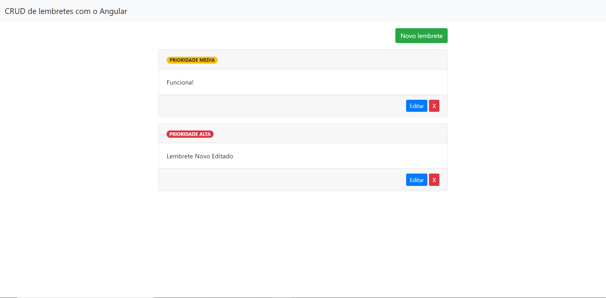
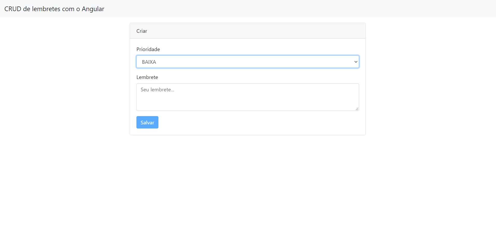

# Painel de Lembretes - Angular

## Tela Inicial

## Novo Lembrete

* 8º projeto, feito em HTML, CSS, JavaScript, Bootstrap, TypeScript e Angular.
* Projeto desenvolvido no curso de Angular da DevMedia.
* APIs disponibilizadas pela DevMedia.
* Utilização de Rotas para melhor experiência do usuário.
* Utilização de componentes para melhor organização e funcionalidade do projeto.
